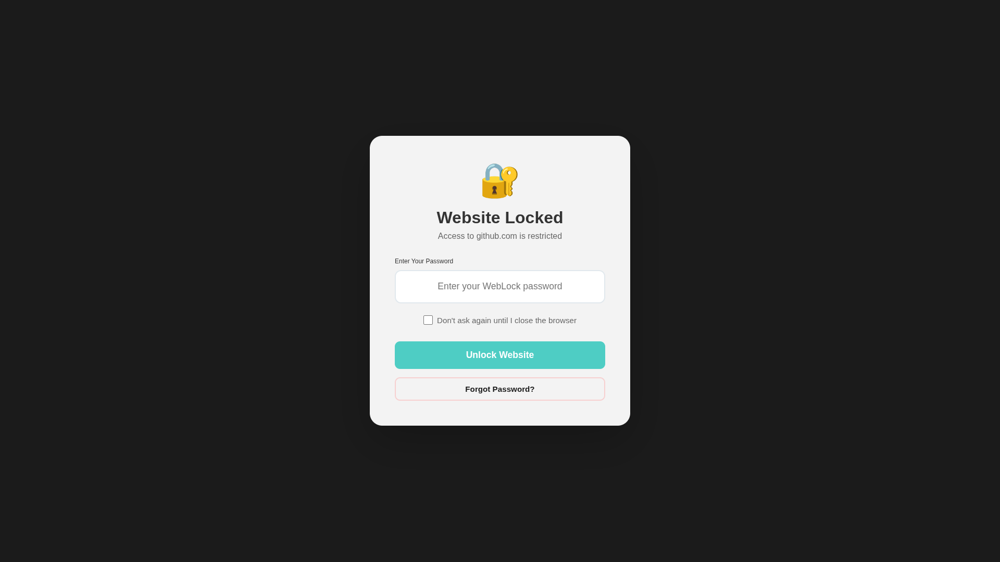

# WebLock 🔐

## Problem locking websites? Want something like AppLock but for websites? No problem, here it comes! 

*Because apparently we need to keep nosy people away from our browser tabs. Privacy is a thing, you know?* 🤷‍♂️

Got a problem with people snooping around your browser when you step away? Need to keep your banking, social media, or private websites safe from prying eyes? Well, congratulations! You've found your digital bodyguard. 

WebLock is basically like having a personal security guard for your browser tabs - except instead of wearing a suit and sunglasses, it just asks for a password before letting anyone through.

## � Screenshot

## �🛠️ Installation

1. Download or clone the repo
2. Open your Chromium-based browser and go to `chrome://extensions/` (for Chrome)
3. Enable "Developer mode" (because you're basically a hacker now)
4. Click "Load unpacked" and select the extension folder
5. Boom! You've successfully installed your own personal website guard

## ✨ Features

- **Password Protection**: Keep your private websites safe from others
- **Smart Unlock Modes**: 
  - Browser session mode (unlock once, browse freely until you close your browser)
  - Tab-only mode (for maximum security)
- **URL Management**: Add, edit, or remove websites from your protection list
- **Password Recovery**: For when you forget your password (we've all been there)
- **Instant Blocking**: URLs get locked down faster than you can say "mind your own business"

## 🔒 Security & Storage

- **Local Storage Only**: Your private website list stays on your computer
- **Password Hashing**: Uses SHA-256 because we're fancy like that
- **No External Servers**: Your data doesn't go anywhere (unlike other people's curiosity)
- **Browser-Only**: Works entirely in Chromium-based browsers, no cloud nonsense

## 🐛 Limitations

- **Chromium-based browsers only**: Sorry Firefox users, you're on your own
- **Demo OTP**: The "forgot password" feature is basically playing pretend
- **No Mobile Version**: Your phone privacy is a whole different problem

*Remember: This extension is like a lock on your diary - it only works if you remember to use it. Keep those nosy people away!* 😏
